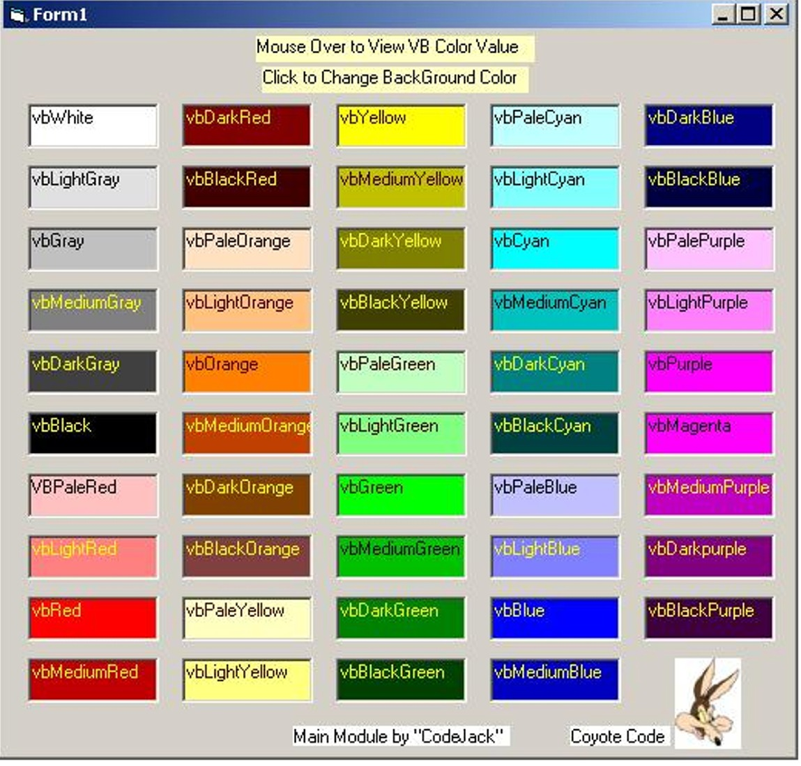



## VB Colors Extended Select

### Description

Quick reference color Viewer and selector. Allows you to view color combinations without having to bounce back and forth in the property selector.

"CodeJack" submitted the main module of this and I just decided to use it and flip out this for fun. We all gotta play sometimes. This can be used as a quick reference in your color selection. Come on - make those apps funtional and aestheticly pleasing too. Enjoy!
 
### More Info
 

             |
---                |---
**Submitted On**   |2001-05-09 07:17:56
**By**             |[Coite Moss](https://github.com/Planet-Source-Code/PSCIndex/blob/master/ByAuthor/coite-moss.md)
**Level**          |Advanced
**User Rating**    |3.5 (14 globes from 4 users)
**Compatibility**  |VB 5\.0, VB 6\.0
**Category**       |[Graphics](https://github.com/Planet-Source-Code/PSCIndex/blob/master/ByCategory/graphics__1-46.md)
**World**          |[Visual Basic](https://github.com/Planet-Source-Code/PSCIndex/blob/master/ByWorld/visual-basic.md)
**Archive File**   |[VB Colors 196245142001\.zip](https://github.com/Planet-Source-Code/coite-moss-vb-colors-extended-select__1-23183/archive/master.zip)

